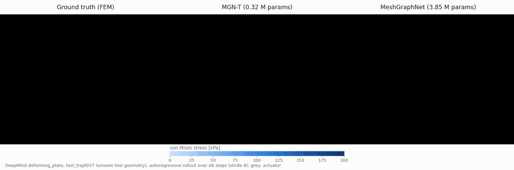
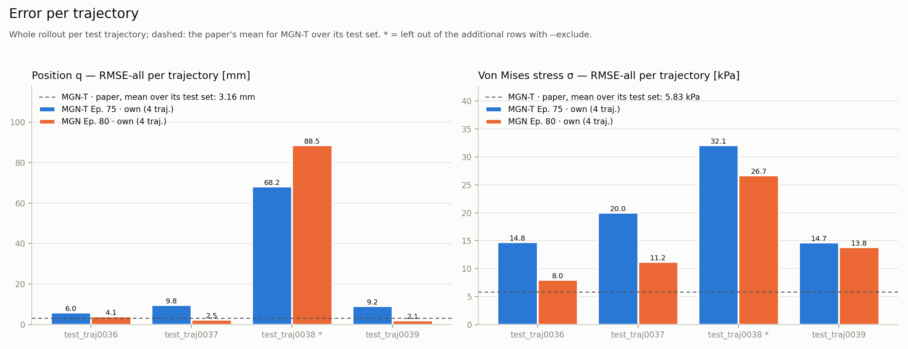

# CrashDefNet

**Learned deformation prediction for crash, from raw simulation data to validated
predictions.** A complete, lean PyTorch workflow: dataset export, training,
autoregressive rollout and evaluation against published results. New model
architectures plug in quickly, so the latest research can be put to work and compared
under identical conditions.

[](LICENSE)




*Autoregressive rollout on a test geometry that was not part of training. Left: FEM
ground truth. Middle and right: the two architectures in CrashDefNet. Colour: von Mises
stress.*

---

## What is CrashDefNet?

CrashDefNet (**Crash Deformation Network**) is a deep-learning tool for **predicting
structural deformation**. It learns from finite element simulations and predicts,
step by step on the simulation mesh, how each node moves and which stress it carries.
The full chain is covered: from the raw simulation data through dataset export,
training and autoregressive rollout to the evaluation against published results.

Two things define it: it covers the **complete workflow** that an application needs,
and it stays **lean enough** that new model architectures can be integrated and
compared quickly. The application it is built for is **crash deformation**.

This first public release (v0.1.0) is developed and validated on DeepMind's open
**`deforming_plate`** dataset: an actuator impacts and deforms plates of varying
geometry. It is a simplified crash scenario with contact and large deformations, and
the approach transfers directly to more complex crash cases. The release ships two
graph neural network architectures that run through the same pipeline and can be
compared directly:

- **MeshGraphNet (MGN)**: the original architecture for mesh-based simulation
  (Pfaff et al., ICLR 2021)
- **MeshGraphNet-Transformer (MGN-T)**: the current state of research (Iparraguirre
  et al., 2026). It combines local message passing with a physics-attention
  transformer as a global processor and targets exactly the setting of crash: impact
  dynamics with self-contact and plasticity on industrial-scale meshes

## Highlights

- **Complete workflow.** From raw simulation data to validated predictions: streaming
  dataset export, training with position noise and rollout validation, autoregressive
  rollout with contact, the metrics of the papers, comparison reports and ParaView
  export.
- **New architectures, quickly.** A new model is one file plus a few lines that register
  it in the config and the model factory. Data, training, rollout, metrics and the
  comparison with the paper work unchanged ([guide](docs/adding-an-architecture.md)).
- **MGN-T, implemented from the paper.** The authors of MGN-T have not published
  code. CrashDefNet implements it from the paper, including the physics attention of
  Transolver / Transolver++ that MGN-T builds on. Every gap in the paper and the
  assumption chosen to fill it is documented in [`models/mgn_t.py`](models/mgn_t.py).
- **Lean code base.** Plain PyTorch and PyTorch Geometric: about 4,600 lines of Python
  from data export to evaluation, readable end to end.
- **Direct comparison with the original.** Both architectures share the data,
  normalization, training loop and metrics. The metrics of the MGN-T paper
  (RMSE-1, RMSE-all, R-RMSE for position and stress) are computed for every rollout,
  and a report generator sets them against the paper's tables.
- **Physically consistent rollout.** Positions are integrated from the predicted
  velocity. Contact (world) edges are rebuilt from the predicted geometry at every
  step. Results can be exported to ParaView as a time series (`.vtu` + `.vtu.series`).
- **Traceability.** Every rollout records the SHA-256 of checkpoint and dataset, the
  full training config, the command line and the git commit.
- **Scales from laptop to GPU.** A CPU quick test runs in minutes. A streaming export
  to SQLite and optional lazy loading handle datasets larger than RAM. A Docker image
  is included for GPU training.

## Background

CrashDefNet is developed by **Felix Stocker**, a data scientist with 4.5 years of
experience in CAE and crash simulation. For one year of that, the work focused
entirely on deep learning for 3D geometries: research and development together with
companies that sell such software commercially.

CrashDefNet builds on this experience as a **self-developed, independent tool:
complete in function, lean in code.**

- **Complete workflow.** Everything from the raw simulation data to validated
  predictions and reports is part of the tool.
- **Fast integration.** A new architecture goes from the paper into a trained,
  evaluated model within one pipeline. MGN-T, published in 2026, is the first example.
- **Fair comparison.** Every architecture runs on the same data, training loop and
  metrics, next to MeshGraphNet and the numbers of the papers.
- **Full control.** Every part, from data preparation to model and evaluation, can be
  changed as needed; the code base is compact and readable.
- **Focused on crash.** The application is crash deformation, not a general-purpose
  platform.

Beyond this release, a comprehensive pipeline exists that processes VTK data (VTU/VTP)
directly, as exported by CAE solvers; it is not part of this release.

## Roadmap

- Integrate and test further recent architectures as they are published
- More complex crash scenarios (dynamic impact, plasticity), with all architectures
  side by side
- Integration of the existing VTU/VTP pipeline for data exported directly by CAE
  solvers
- Training on the full `deforming_plate` training split at stride 1, as in the papers

## First results (preliminary)

A first comparison on a reduced setup: 28 training geometries, stride 8, 4 unseen
test geometries, one RTX A4000. Both models come from first training runs with
reasonable results, not from systematically optimized ones.

| | MGN-T | MeshGraphNet |
|---|---|---|
| Parameters | **0.32 M** | 3.85 M |
| Training time | **38 min** | 3 h 41 min |
| Position error, RMSE-all (4 test geometries) | **34.7 ± 15 mm** | 44.1 ± 21 mm |
| Position error, RMSE-all (without the outlier) | 8.6 ± 1.2 mm | **3.0 ± 0.6 mm** |
| Stress error, RMSE-all (4 test geometries) | 21.6 ± 4.1 kPa | **16.5 ± 4.1 kPa** |

- **Efficiency.** MGN-T reaches the same order of accuracy with 12× fewer parameters
  and 4–5× less training time per epoch.
- **Accuracy.** MeshGraphNet is more accurate on three of the four test geometries.
- **The outlier.** On the hardest geometry MGN-T is more accurate. This geometry
  deforms by up to 490 mm, more than anything in the training data.

These runs used far less data and training than the paper, so the numbers are not a
reproduction of the paper's results. Setup, all metrics, the comparison with the paper
and next steps: **[docs/results.md](docs/results.md)**.



## Installation

Requirements: Python 3.10–3.12, Linux or WSL2 (tested with Python 3.12). A GPU is
optional.

```bash
git clone https://github.com/stofe94/crash-def-net.git
cd crash-def-net

# conda (recommended)
conda env create -f environment.yml
conda activate crashdefnet

# or pip / venv
python -m venv .venv && source .venv/bin/activate
pip install -r requirements.txt          # GPU (CUDA 12.6): requirements-gpu.txt
```

Raw data: [`meta.json`](https://storage.googleapis.com/dm-meshgraphnets/deforming_plate/meta.json) and [`test.tfrecord`](https://storage.googleapis.com/dm-meshgraphnets/deforming_plate/test.tfrecord) of
DeepMind's `deforming_plate` (~0.8 GB, 100 trajectories). For now only the test file
is used, for reasons of size (the training file holds 1,000 trajectories in 9.9 GB);
the exporter splits its 100 trajectories into separate train, validation and test
sets. The files are not part of the repository:

```bash
wget -P datasets/deforming_plate/raw_dataset \
    https://storage.googleapis.com/dm-meshgraphnets/deforming_plate/meta.json \
    https://storage.googleapis.com/dm-meshgraphnets/deforming_plate/test.tfrecord
```

Details, GPU setup and troubleshooting: [docs/installation.md](docs/installation.md).

## Quick start

A complete run on the CPU with a small dataset (8/2/2 trajectories). Each epoch takes
about 4–5 minutes.

```bash
# 1) Export a small dataset (~3 s, ~10 MB) -> data/deforming_plate_s10_small/
python -m dataset_preprocessor.export

# 2) Train with the example config (MeshGraphNet; for MGN-T set architecture = "mgn_t")
python train/train.py --config config.example.toml

# 3) Roll out the trained model on the test split -> rollouts/<time>_<run>_<checkpoint>_test/
python predict/rollout.py --checkpoint checkpoints/example_run/best_model.pt \
    --data-dir data/deforming_plate_s10_small --split test

# 4) Loss curves -> checkpoints/example_run/loss_curves.png
python utils/plot_losses.py --run-dir checkpoints/example_run

# 5) Compare all finished rollouts with the MGN-T paper -> evaluations/<time>_paper_comparison/
python utils/compare_paper.py
```

## Docker (GPU)

The image contains the code only; the dataset is mounted from the host.

```bash
cp .env.example .env          # set DATASET_DIR (and optionally CONFIG)
docker compose build
docker compose up             # trains with the config from .env on the GPU
```

Export and rollout inside the container, CUDA versions and hints for small GPUs:
[docs/docker.md](docs/docker.md).

## Documentation

| Topic | |
|---|---|
| [Installation](docs/installation.md) | conda / pip, GPU, raw data, troubleshooting |
| [Data](docs/data.md) | export, dataset format, graph features, optional history |
| [Models](docs/models.md) | MeshGraphNet and MGN-T, documented assumptions |
| [Adding an architecture](docs/adding-an-architecture.md) | how a new model plugs into the pipeline |
| [Training](docs/training.md) | training loop, noise, validation, early stopping, config reference |
| [Rollout and evaluation](docs/rollout-and-evaluation.md) | rollout, paper metrics, comparison report, ParaView |
| [Docker](docs/docker.md) | GPU training in a container |
| [Results](docs/results.md) | first comparison MGN vs MGN-T vs paper |

## Project structure

```
config.example.toml          example training config (CPU quick test); copy and adapt for own runs
dataset_preprocessor/
  export.py                  CLI: DeepMind TFRecord -> dataset.db + normalizer.json + metadata.json
  dataset.py                 DeformingPlateDataset: one graph per time step
  graph_features.py          feature layout, mesh and world edges, consistent position noise
models/
  meshgraphnet.py            MeshGraphNet (mesh + world edges)
  mgn_t.py                   MeshGraphNet-Transformer (physics attention)
  residual.py                optional residual target wrapper
train/                       training CLI, config, trainer, early stopping
predict/rollout.py           autoregressive rollout, paper metrics, .vtu export
utils/                       normalizer, loss curves, paper comparison, time zone
docker/, Dockerfile,         GPU training in a container
docker-compose.yml
docs/                        documentation and figures
```

Not versioned: `datasets/` (raw data), `data/` (exports), `checkpoints/`, `rollouts/`,
`evaluations/`.

## References

- T. Pfaff, M. Fortunato, A. Sanchez-Gonzalez, P. W. Battaglia. *Learning Mesh-Based
  Simulation with Graph Networks.* ICLR 2021. [arXiv:2010.03409](https://arxiv.org/abs/2010.03409)
- M. M. Iparraguirre, I. Alfaro, D. González, E. Cueto. *MeshGraphNet-Transformer:
  Scalable Mesh-Based Learned Simulation for Solid Mechanics.* 2026.
  [arXiv:2601.23177](https://arxiv.org/abs/2601.23177)
- H. Wu, H. Luo, H. Wang, J. Wang, M. Long. *Transolver: A Fast Transformer Solver for
  PDEs on General Geometries.* ICML 2024. [arXiv:2402.02366](https://arxiv.org/abs/2402.02366)
  (physics attention, used in the global processor of MGN-T)
- H. Luo et al. *Transolver++: An Accurate Neural Solver for PDEs on Million-Scale
  Geometries.* 2025. [arXiv:2502.02414](https://arxiv.org/abs/2502.02414)
  (eidetic states of the physics attention, used in MGN-T)
- Dataset: `deforming_plate` from DeepMind's
  [MeshGraphNets release](https://github.com/google-deepmind/deepmind-research/tree/master/meshgraphnets)
  (downloaded separately, not redistributed)

## Acknowledgements

Thanks to DeepMind for publishing MeshGraphNets together with its datasets, and to the
authors of MGN-T for the detailed description of their architecture.

## Citation

If you use CrashDefNet, please cite it (see [CITATION.cff](CITATION.cff)):

```bibtex
@software{stocker_crashdefnet_2026,
  author  = {Stocker, Felix},
  title   = {CrashDefNet: Learned Deformation Prediction on Simulation Meshes},
  year    = {2026},
  version = {0.1.0},
  url     = {https://github.com/stofe94/crash-def-net}
}
```

## Contributing

Suggestions are welcome as issues or pull requests; see [CONTRIBUTING.md](CONTRIBUTING.md).

## License

[Apache License 2.0](LICENSE). Copyright 2026 Felix Stocker.

## Author

**Felix Stocker**, data scientist (CAE, crash simulation, deep learning on 3D geometries)

- E-mail: [felix.stocker@sto-eng.de](mailto:felix.stocker@sto-eng.de)
- LinkedIn: [linkedin.com/in/felixstocker](https://www.linkedin.com/in/felixstocker)
- Competency profile: [stofe94.github.io/competency_profile](https://stofe94.github.io/competency_profile/)
