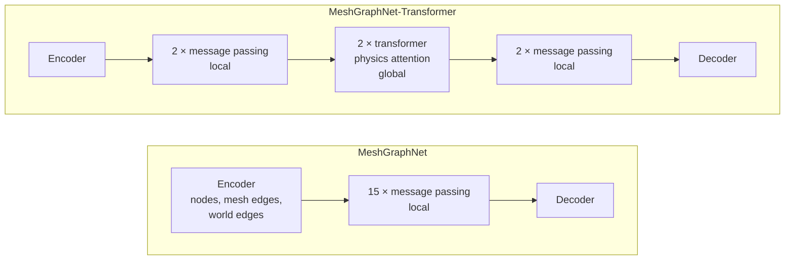

# Models

Both architectures take the same graph (nodes, mesh edges, world edges; see
[data.md](data.md)) and return the same output: the normalized velocity and stress per
node for the next time step. The architecture is selected in the config:

```toml
[model]
architecture = "meshgraphnet"   # or "mgn_t"
```



## MeshGraphNet (`meshgraphnet`)

[`models/meshgraphnet.py`](../models/meshgraphnet.py), after Pfaff et al., *Learning
Mesh-Based Simulation with Graph Networks* (ICLR 2021), Encode-Process-Decode with two
edge sets:

- **Encoder:** separate MLPs for nodes, mesh edges and world edges, each followed by
  LayerNorm
- **Processor:** L blocks with their own weights. Per block
  - e′ᴹᵢⱼ = fᴹ(eᴹᵢⱼ, vᵢ, vⱼ) and e′ᵂᵢⱼ = fᵂ(eᵂᵢⱼ, vᵢ, vⱼ)
  - v′ᵢ = fⱽ(vᵢ, Σⱼ e′ᴹᵢⱼ, Σⱼ e′ᵂᵢⱼ)
  - residual connections: v ← v + v′, e ← e + e′; every f is an MLP + LayerNorm
- **Decoder:** MLP without LayerNorm on the final node latents
- All MLPs: ReLU, `num_mlp_layers` hidden layers of width `latent_size`

Paper size: `latent_size = 128`, `num_message_passing_steps = 15`, 2 hidden layers
(3.85 M parameters with mesh and world edges). `config.example.toml` uses 64 / 8 so that
it trains on a CPU.

The weakness that MGN-T addresses: information travels one edge per message passing
step. On large meshes a deep stack is needed for effects to reach distant nodes
("under-reaching"), which makes the model large and slow.

## MeshGraphNet-Transformer (`mgn_t`)

[`models/mgn_t.py`](../models/mgn_t.py), after Iparraguirre et al.,
*MeshGraphNet-Transformer: Scalable Mesh-Based Learned Simulation for Solid Mechanics*
(2026, [arXiv:2601.23177](https://arxiv.org/abs/2601.23177)).

Instead of 15 message passing steps, MGN-T uses

1. **2 local message passing steps** (same blocks as MeshGraphNet) that encode the
   neighbourhood of every node,
2. **2 transformer blocks with physics attention** as a global processor, which
   update all nodes at once,
3. **2 further local steps** that refine the result,

followed by the decoder. MLPs use LeakyReLU and LayerNorm (paper Tab. 2).

**Physics attention** (Transolver, Wu et al. 2024, with the eidetic states of
Transolver++, Luo et al. 2025) avoids attention over all N nodes, which would cost
O(N²):

```
tau  = tau_0 + Linear(x)                            learned temperature
w    = Softmax((Linear(x) - log(-log(eps))) / tau)   slice weights (N × P)
z_j  = Σ_i w_ij x_i / Σ_i w_ij                       slicing: nodes -> P tokens
z'   = Softmax(Q Kᵀ / √c) V                          attention over P tokens only
x'_i = Σ_j w_ij z'_j                                 de-slicing: tokens -> nodes
```

With P = 128 tokens the cost grows linearly with the number of nodes. A sinusoidal
positional encoding of the undeformed geometry (`mesh_pos`) is added before the
transformer.

Paper settings (Tab. 2): widths 64-32-64, 4 heads, 128 tokens, ~0.5 M parameters. With
mesh and world edges and the choices below, CrashDefNet's MGN-T has 0.32 M parameters.

### Assumptions where the paper leaves gaps

No code has been published for MGN-T. Where the paper does not specify a detail, the
following choices were made. Each one is marked in the code:

1. **De-slicing** is only described as "projects P back onto N"; it uses the same slice
   weights as slicing, as in Transolver.
2. **Gumbel noise** is drawn from U(0, 1), the standard choice, and only during
   training. The paper writes ε ~ N(0, 1), for which −log(−log(ε)) is undefined.
3. **Temperature** τ is kept positive with softplus; otherwise it could reach zero.
4. **Positional encoding:** 3 axes × sin/cos × `pe_frequencies` frequencies
   (2⁰ … 2^(F−1)), normalized per graph to [0, 1]. The paper cites Vaswani et al. and
   gives no dimension.
5. **Widths "64-32-64"** are read as: message passing 64, transformer 32,
   refinement 64.
6. **Residual connection** around the transformer stage and pre-norm blocks (standard,
   not described in the paper).
7. **Decoder without LayerNorm** (as in MeshGraphNet); normalizing the output would
   destroy the magnitude of the prediction.
8. **Batches may mix trajectories:** slicing and attention run per graph. The paper
   needs one trajectory per batch only because of its matrix reshaping.

### Parameters (`[model.mgn_t]`)

| Key | Default | Meaning |
|---|---|---|
| `latent_size` | 64 | width of the message passing stages |
| `token_dim` | 32 | width of the transformer |
| `num_tokens` | 128 | physical tokens P |
| `num_heads` | 4 | attention heads |
| `num_transformer_blocks` | 2 | transformer blocks |
| `num_pre_mp_steps` / `num_post_mp_steps` | 2 / 2 | local steps before / after the transformer |
| `pe_frequencies` | 8 | frequencies of the positional encoding (not in the paper) |
| `ffn_ratio` | 4 | hidden width of the feed forward block / `token_dim` (not in the paper) |
| `tau_init` | 0.5 | initial temperature τ₀ (not in the paper) |

## Optional residual target (`residual_target = true`)

[`models/residual.py`](../models/residual.py) wraps either architecture. The network
then predicts the normalized *change* of every target that has a matching `*_prev`
input, instead of its absolute value. This needs an export with `--history 1` (not in
the paper). A freshly initialized network then starts at the "copy the previous value"
baseline.

## Adding an architecture

A new architecture plugs into the same pipeline in four small steps; see
[adding-an-architecture.md](adding-an-architecture.md).

## Checkpoints

The trainer saves the model's `state_dict` together with the full training config and
the dataset metadata (feature layout). `train.trainer.load_trained_model` rebuilds the
model from a checkpoint; the rollout uses it. The normalizer is read from
`normalizer.json` of the dataset folder, which must be the dataset the model was
trained on (the rollout checks the feature layout and warns if the export settings
differ). The attribute names of the modules are
`state_dict` keys: renaming them breaks existing checkpoints.
