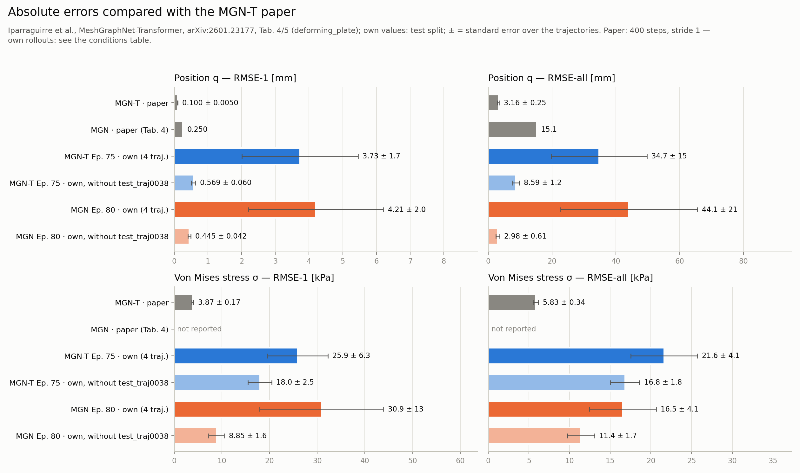
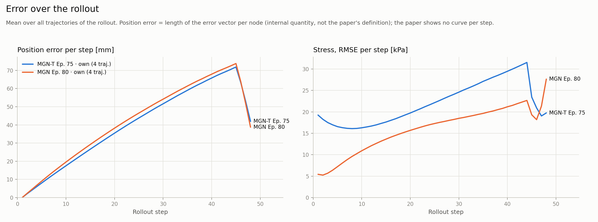

# First results (v0.1.0, preliminary)

This page documents the first comparison of the two architectures in CrashDefNet,
**MeshGraphNet (MGN)** and **MeshGraphNet-Transformer (MGN-T)**, on DeepMind's
`deforming_plate` benchmark, and relates the numbers to the values published in the
MGN-T paper. The runs were deliberately small (a reduced dataset and a single GPU for
a few hours). Both models come from first training runs with reasonable results; they
were not tuned or optimized systematically. They show that the full pipeline works end
to end and how the two architectures behave. They are **not** a reproduction of the
paper's numbers.


*Autoregressive rollout of test trajectory 37 (a geometry the models never saw during
training). Colour: von Mises stress, same scale in all three panels. Grey: the actuator,
whose motion is prescribed.*

## Setup

| | MGN-T (own) | MeshGraphNet (own) |
|---|---|---|
| Architecture | 2 + 2 message passing steps, 2 transformer blocks, 128 physics tokens (paper Tab. 2) | 15 message passing steps, latent 128 (paper size), mesh + world edges |
| Parameters | **0.32 M** | 3.85 M |
| Data | 40 trajectories of `test.tfrecord`, split 28 / 8 / 4 (train / val / test), 50 frames per trajectory at stride 8 | same |
| Training | batch 4, early stopping after 75 of 120 epochs, **38 min** (~25–30 s per epoch) | batch 2, ended after 93 of 120 epochs, **3 h 41 min** (~2 min per epoch) |
| Hardware | 1× NVIDIA RTX A4000 (16 GB) | same |
| Evaluated checkpoint | epoch 75 | epoch 80 (best by rollout MSE) |
| Model selection | rollout MSE on the val split | same |
| Rollout | 48 autoregressive steps over the whole load case (loading and unloading), 4 unseen test geometries | same |

The trajectories come from DeepMind's test file, used for reasons of size (100
trajectories in 0.8 GB instead of 1,000 in 9.9 GB for the training file). Both models
share the same dataset, normalization, noise (σ = 3·10⁻³ m on the
positions of free nodes), learning-rate schedule (1e-4 → 1e-6, exponential) and
validation. Model selection used the rollout MSE; for new runs the position error
(`selection_metric = "pos_rmse"`, as in `config.example.toml`) is recommended, since it
penalizes drift.

## Metrics

The metrics follow the MGN-T paper (Tab. 4/5) and are computed by
[`predict/rollout.py`](../predict/rollout.py); the comparison with the paper is
produced by [`utils/compare_paper.py`](../utils/compare_paper.py).

- **q**: node position (m), **σ**: von Mises stress (Pa)
- **RMSE-all**: RMSE over the whole rollout (all nodes, components, steps and trajectories)
- **RMSE-1**: one step from the ground-truth state
- **±**: standard error over the test trajectories

## Results

| Model | Params | q RMSE-all [mm] | σ RMSE-all [kPa] | q RMSE-1 [mm] | σ RMSE-1 [kPa] |
|---|---|---|---|---|---|
| MGN-T · own (4 test traj.) | 0.32 M | **34.7 ± 15** | 21.6 ± 4.1 | **3.73 ± 1.7** | **25.9 ± 6.3** |
| MeshGraphNet · own (4 test traj.) | 3.85 M | 44.1 ± 21 | **16.5 ± 4.1** | 4.21 ± 2.0 | 30.9 ± 13 |
| MGN-T · own, without traj. 38 | 0.32 M | 8.59 ± 1.2 | 16.8 ± 1.8 | 0.569 ± 0.060 | 18.0 ± 2.5 |
| MeshGraphNet · own, without traj. 38 | 3.85 M | **2.98 ± 0.61** | **11.4 ± 1.7** | **0.445 ± 0.042** | **8.85 ± 1.6** |
| *MGN-T · paper (Tab. 5)* | *0.5 M* | *3.16 ± 0.25* | *5.83 ± 0.34* | *0.100 ± 0.005* | *3.87 ± 0.17* |
| *MGN · paper (Tab. 4)* | *2.0 M* | *15.1* | *–* | *0.25* | *–* |


### What the numbers show

- **Efficiency.** MGN-T reaches errors of the same order of magnitude as MeshGraphNet
  with **12× fewer parameters** and **4–5× less training time per epoch**.
- **Accuracy on typical geometries.** On three of the four test geometries
  MeshGraphNet is clearly more accurate, both in position and in stress. The
  animation above shows the typical failure mode of the MGN-T run: the free edges of
  the plate drift over the rollout.
- **Outlier: test trajectory 38.** Its largest node displacement is 490 mm. That is
  more than in any of the 28 training trajectories (maximum 301 mm, median 76 mm),
  so both models have to extrapolate. This one trajectory dominates the mean over
  all four. On it MGN-T is more accurate than MeshGraphNet (68 vs 89 mm). The rows
  "without traj. 38" are therefore listed separately, pooled like the paper.

### Further figures

All metrics next to the paper's values (bars: mean, whiskers: standard error over the
test trajectories):



Error over the rollout, averaged over the four test trajectories. Both curves are
dominated by trajectory 38; the drop at the end is the unloading phase, where the plate
springs back:



### Why the numbers are not comparable with the paper

| | Paper | Own runs |
|---|---|---|
| Training data | number of trajectories not stated (DeepMind's training split holds 1,000) | 28 trajectories |
| Time step | stride 1, 400 rollout steps | stride 8, 48 rollout steps |
| Training time | MGN-T ~8 h on an RTX 4090 | MGN-T 38 min on an RTX A4000 |
| Test set | size not stated | 4 trajectories |

- **RMSE-1** is not comparable: at stride 8 the nodes move about eight times as far
  per step as in the paper.
- **RMSE-all** covers the same physical time span, but with fewer steps, which means
  fewer chances for errors to accumulate. The row "MeshGraphNet without traj. 38"
  (2.98 mm) is below the paper's MGN-T value (3.16 mm). That is **not** a better
  result, only a consequence of these different conditions.

## Next steps

- Train on the full training split (`train.tfrecord`, 1,000 trajectories) at stride 1,
  as in the paper, using lazy loading (`[data] lazy = true`)
- Evaluate on a larger test set, with several seeds per architecture
- Select both models by position error (`selection_metric = "pos_rmse"`), which
  penalizes drift
- Compare at equal training budget (wall-clock time and number of optimizer steps)

## Reproducing

```bash
# 1) Dataset (~10 s, ~44 MB)
python -m dataset_preprocessor.export --out-dir data/deforming_plate_s8_t40 \
    --n-train 28 --n-val 8 --n-test 4 --num-steps 50 --time-stride 8

# 2) Training (GPU): one config per model, derived from config.example.toml
#    (data_dir, architecture, model size, epochs, batch size as in the setup table)
python train/train.py --config configs/<mgn_t run>.toml
python train/train.py --config configs/<mgn run>.toml

# 3) Rollouts on the test split
python predict/rollout.py --checkpoint checkpoints/<mgn_t run>/<checkpoint>.pt \
    --data-dir data/deforming_plate_s8_t40 --split test
python predict/rollout.py --checkpoint checkpoints/<mgn run>/<checkpoint>.pt \
    --data-dir data/deforming_plate_s8_t40 --split test

# 4) Comparison with the paper (figures, tables, report in evaluations/)
python utils/compare_paper.py rollouts/<mgn_t rollout> rollouts/<mgn rollout> --exclude test_traj0038
```

Each rollout folder contains `rollout_info.json` with the SHA-256 of checkpoint and
dataset, the full training config, the command line and the git commit. That makes
every number on this page traceable to its inputs.
